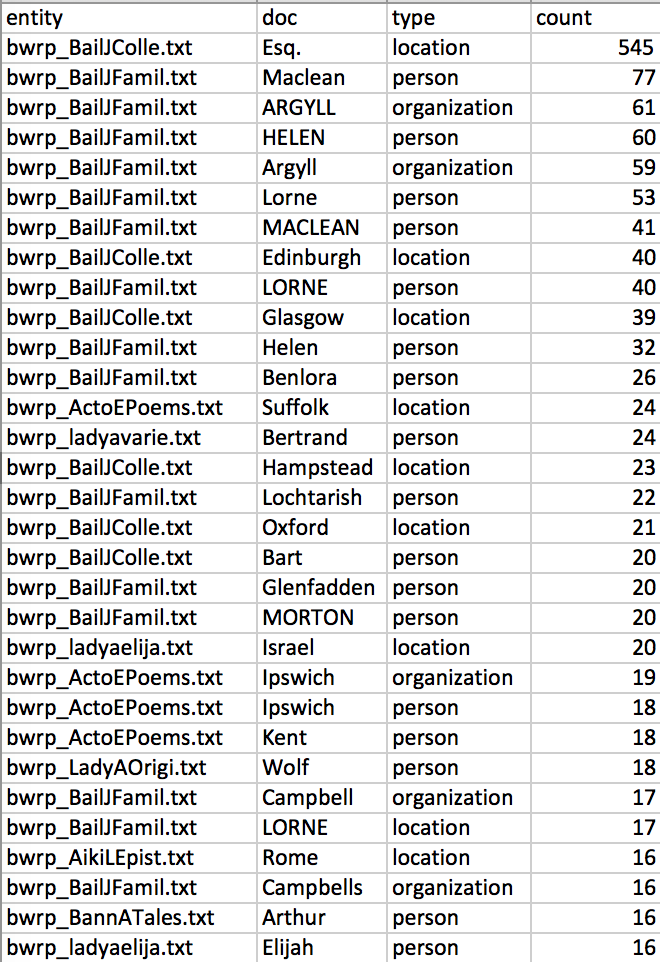

## Adding Structure and Extracting Features

[Slides are here](https://docs.google.com/presentation/d/1sRC1cilTHQ4QWTiFa2xu9WQj_XU3ZyLbFUB3WAsTxmk/edit?usp=sharing)

**Since we didn't do all of the steps in the Command Line Bootcamp yesterday, please delete the 'Project' folder on your Desktop and then download and unzip this ['projects' folder with prepared texts](https://github.com/dmics/adding-extracting/blob/master/project.zip) and put it on your Desktop.**

**Please also drag the 'stanford-ner-2018-02-27' folder to the Desktop (it's in User/Applications).**

### Tesseract Optical Character Recognition (OCR)
#### Description
Tesseract-OCR is an open source OCR (optical character recognition) engine, originally developed by Hewlett Packard Laboratories. The standard installation of Tesseract-OCR can convert images of text in 39 different languages to plain text data.  

#### Scenario
You visit an archive and need to capture images of text based archival collections for your research - ultimately you would like to convert these images into data that you can search, visualize, text mine, etc. Using a digital camera and/or a copier you capture photos of archival collections in the .tif / .tiff format. With these files in hand you are prepared to use Tesseract-OCR to convert your images into plain text files.

*Sometimes we get page images, but what we really need is plain text. Tesseract is free OCR software available in lots of languages that can generate text from images at a large scale.*

Navigate to the sevenagesofwoman folder (/Desktop/project/corpora/sevenagesofwoman)

`$ cd sevenagesofwoman`

List files in the sevenagesofwoman folder

`$ ls`

Convert one tiff file to one txt file using Tesseract OCR

`$ tesseract sevenagesofwoman_thebride.tiff sevenagesofwoman_thebride`

Using your GUI, compare the tif file to the txt files you generated

While we’re here, why don’t we just OCR all of them in one batch?

`$ for i in *.tiff ; do tesseract $i $i; done;`
>*Remember our loop from the Command Line Bootcamp? This works the same way, but condenses everything to a single line using semicolons between commands.*

----
*FYI for Windows Users*

Find tesseract.exe (it’s probably in Program Files (x86)) and drag it
in. You can also try the path below and then hunt down the file if it
doesn’t work

`$ '/c/Program Files (x86)/Tesseract-OCR/tesseract.exe' sevenagesofwoman_thebride.tif sevenagesofwoman_thebride`

Using your GUI, compare the tif file to the txt files you generated

While we’re here, why don’t we just OCR all of them in one batch?

`$ for %i in (*.tif) do '/c/Program Files
(x86)/Tesseract-OCR/tesseract.exe' %i %i`

----

### EGREP and Regular Expressions

#### Searching & Mining

Move back to the BWRP books

`$ cd ..`

Find out how many lines and words there are in a text of your choosing using **wc -l -w**

`$ wc -l -w bwrp_ActoEPoems.txt`

Results:

```
1607 15242 bwrp_ActoEPoems.txt
```
>1607 lines and 15,242 words

Do some very basic searching with egrep — this will print the entire line it's mentioned in

`$ egrep europe *txt`

`$ egrep Europe *txt`

`$ egrep America *txt`

Do some very basic counting with **egrep -c**

`$ egrep -c man *txt`

`$ egrep -c woman *txt`

Count only whole words using **egrep -cw**

`$ egrep -cw man *txt`

The possibilities for regular expressions are endless (and sometimes difficult and always ugly), but you can also find matching patterns.

What 18th and 19th century years (or very similar four character numbers) are mentioned in these texts?
`$ egrep -o '\b1[7-8][0-9][0-9]\b' *txt`
> the -o flag returns just the text that matches the pattern
this looks for four numbers in a row that start with a 17 or 18—the rest can be any numbers

It's possible that some of these aren't years. They could be page numbers or amounts or anything else. Let's do a search that includes some context, but not the entire line.

`$ egrep -o '.{0,50}\b1[7-8][0-9][0-9]\b.{0,50}' *txt`

This context feature is interesting. What if we wanted to look at the words around 'America' to see what people are saying without getting every full line?

`$ egrep -o '.{0,50}America.{0,50}' *txt`

We could even move this into a separate corpus if we wanted by adding `> americacontext.text` to that search.

### Stanford NER

#### Description
Stanford Named Entity Recognizer is a Java implementation of Named Entity Recognizer. Named Entity Recognition (NER) is method that allows automatic labelling of things like people, organizations, and geographic locations in unstructured text. The standard installation of this software works relatively well on English sources ([German, Spanish, and Chinese are available as well](https://nlp.stanford.edu/software/CRF-NER.shtml)). The tool provides a graphical user interface that allows quick experimentation with the potential utility of this approach for your research question. For more advanced usage, e.g. training the tool on a specific corpus, command line interaction is needed.

#### Scenario

You want to assess the frequency of mentions of people and places in work(s) of literature. While you could use a simple text editing program to find all occurrences of X person or Y place, doing so would require comprehensive prior knowledge of all possible people and places. Rather than attempt to pre define these possibilities you decide to explore automatic recognition of people and places to provide a foundation to your assessment.

#### NER GUI Tool

**Before we start, please make sure you drag the stanford-ner-2018-02-27 folder from User/Applications to your Desktop.**

1. Open the Stanford NER folder and double click stanford-ner.jar. This will open a window with some sample text.
1. Load a Classifier: Classifier > Load CRF from File > navigate to stanford-ner-2018-02-27/classifiers folder > select english.all.3class.distsim.crf.ser.gz
1. Once loaded you will see options on the right hand side of the graphical user interface for ORGANIZATION, LOCATION, and PERSON.
1. Load one of the texts in the archive folder: File > Open File > select a file from Desktop/project/corpora
1. Click 'Run NER'
1. Every organization, person, and place that Stanford Named Entity Recognizer is able identify is now tagged.
1. Save the tagged file to your Desktop—File > Save Tagged File as > [ any filename you want ]
1. Open the tagged file in Sublime Text and examine the results - you may want to use cmd+F to search for the tags

#### NER from the Command Line

Stanford NER actually has its own .sh script that you can use to do this work automatically.

Return to your Terminal window. You should still be in the Corpora folder.

`$ ../../stanford-ner-2018-02-27/ner.sh bwrp_ActoEPoems.txt > ner_bwrp_ActoEPoems.txt`

Open ner_ActoEPoems.txt in a text editor and examine the results.

It looks horrific now, but with some [(equally horrific) scripts](https://github.com/brandontlocke/batchner/blob/master/batchner.sh), you can create an accessible listing of named entities in a corpus.


*View of the BWRP entities spreadsheet created by the 'batchner' script linked above*

## Further Resources

[*Sourcecaster*](https://datapraxis.github.io/sourcecaster/)

Ian Milligan and James Baker, [*Introduction to the Bash Command
Line*](http://programminghistorian.org/lessons/intro-to-bash)
